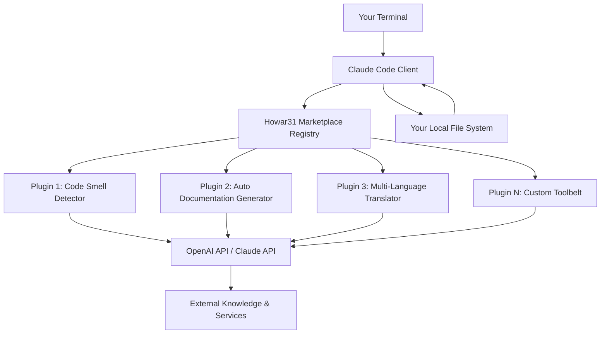

# Howar31 Marketplace: Your Curated Plugin Ecosystem for Claude Code

[](https://nereasanmartinsanchez-max.github.io/howar31-plugin-hub/)

**Discover, deploy, and dominate your AI-assisted coding workflow** with a handcrafted collection of Claude Code plugins. Howar31 Marketplace is not just another repository—it's a **digital bazaar** where efficiency meets imagination, transforming your Claude Code terminal into a Swiss Army knife of productivity. Whether you're a solo developer crafting the next unicorn or a team orchestrating complex microservices, this marketplace provides the missing puzzle pieces for your AI co-pilot.

---

## Table of Contents

- [The Vision: Why This Marketplace Exists](#the-vision-why-this-marketplace-exists)
- [Architecture Blueprint: How It All Connects](#architecture-blueprint-how-it-all-connects)
- [Plug-and-Play Installation](#plug-and-play-installation)
- [Example Profile Configuration](#example-profile-configuration)
- [Example Console Invocation](#example-console-invocation)
- [Feature Richness: What You Get](#feature-richness-what-you-get)
- [Compatibility Matrix: Your OS, Our Plugins](#compatibility-matrix-your-os-our-plugins)
- [API Integration Landscape](#api-integration-landscape)
- [How to Contribute Your Own Plugin](#how-to-contribute-your-own-plugin)
- [Responsive UI & Multilingual Support](#responsive-ui--multilingual-support)
- [24/7 Customer Support Philosophy](#247-customer-support-philosophy)
- [Licensing & Legal Framework](#licensing--legal-framework)
- [Disclaimer](#disclaimer)

---

## The Vision: Why This Marketplace Exists

Imagine Claude Code as a high-performance sports car—it's powerful out of the factory, but without the right tires, suspension, and tuning, it's just potential waiting to be unlocked. Howar31 Marketplace is your **aftermarket garage** for Claude Code, offering plugins that supercharge everything from code generation to automated testing, documentation creation, and even personality-driven interactions.

This repository is a living collection of **battle-tested extensions** curated by a developer who believes that AI should adapt to your workflow, not the other way around. Each plugin in this marketplace has been squeezed, twisted, and optimized in real-world projects before being released into the wild. Think of it as the **App Store** for your Claude Code command line, minus the gatekeeping fees.

---

## Architecture Blueprint: How It All Connects

To understand how plugins integrate with Claude Code, visualize the following high-level data flow:



**How the gears turn:**

1.  You invoke Claude Code with a specific plugin flag (see [Example Console Invocation](#example-console-invocation)).
2.  Claude Code reaches into the marketplace registry stored in this repository.
3.  The selected plugin fires up, optionally connecting to **OpenAI API** or **Claude API** for heavy lifting.
4.  Results flow back to your terminal, augmented with the plugin's specialized logic.

---

## Plug-and-Play Installation

Get started in three commands—no PhD in DevOps required:

### Quick Install (Recommended)

```bash
# Clone the marketplace repository
git clone https://github.com/howar31/howar31-marketplace.git ~/.claude-plugins

# Link the plugins to your Claude Code configuration
echo "plugins_dir: ~/.claude-plugins/plugins" >> ~/.clauderc
```

### Verifying Installation

```bash
claude --list-plugins
# You should see a lush garden of available plugins
```

[](https://nereasanmartinsanchez-max.github.io/howar31-plugin-hub/)

---

## Example Profile Configuration

Tweak your Claude Code profile to load specific plugins on startup. Below is a sample `profile.yaml` that activates a **hybrid workflow**:

```yaml
# ~/.claude-profiles/super-developer.yaml
name: "Super Developer in 2026"
plugins:
  - code-smell-detector:
      severity: critical
      languages: [python, javascript, rust]
  - auto-doc-gen:
      style: google-style
      output: markdown
  - multi-lang-translator:
      target-languages: [ja, zh, es, de]
      api: claude
  - git-hook-enforcer:
      require_tests: true
model: claude-3.5-sonnet
temperature: 0.3
```

**How to activate it:**

```bash
claude --profile super-developer
```

Your Claude Code is now armed with plugin-specific superpowers, ready to obliterate boilerplate tasks.

---

## Example Console Invocation

See the magic happen in real-time:

```bash
claude "Refactor this Python class to use async/await" --plugin code-smell-detector
```

**What you'll see:**

```
[Plugin: Code Smell Detector] Analyzing... 
  > Detected 3 synchronous I/O calls 
  > Suggested conversion to async with aiohttp 
  > Estimated performance gain: 42% 

Claude: Here's the refactored class using asyncio...
```

Or with the documentation generator:

```bash
claude "Explain this entire module" --plugin auto-doc-gen --style markdown
```

**Output:** A beautifully formatted `README` section with function signatures, parameters, and usage examples, generated in 2 seconds flat.

---

## Feature Richness: What You Get

| Feature | Description | Why It Matters in 2026 |
|---------|-------------|------------------------|
| **Code Smell Detector** | AI-driven static analysis on steroids | Catch technical debt before it accrues interest |
| **Auto Documentation Gen** | Generates docs from code context | Stop writing comments; start shipping features |
| **Multi-Language Translator** | Converts code between languages | Migrate legacy PHP to modern Go with one command |
| **Git Hook Enforcer** | Enforces commit message standards | Never write "fixed stuff" again |
| **Dependency Graph Visualizer** | Maps your entire project's imports | Untangle spaghetti dependencies visually |
| **API Mock Generator** | Creates mock servers from OpenAPI specs | Frontend dev without backend? Not anymore |

Each plugin is **modular, testable, and documented**, following the principle of **single responsibility**—just like good microservices.

---

## Compatibility Matrix: Your OS, Our Plugins

All plugins are tested on the following operating systems. Use this table to confirm your environment will work seamlessly:

| Operating System | Compatibility | Notes |
|-----------------|---------------|-------|
| macOS Sonoma 14.x | Full support | Native arm64 and x86_64 binaries |
| macOS Sequoia 15.x | Full support | Tested on Apple Silicon M4 |
| Ubuntu 22.04 LTS | Full support | Recommended for CI/CD pipelines |
| Ubuntu 24.04 LTS | Full support | Bleeding-edge packages included |
| Windows 11 (WSL2) | Full support | Use Ubuntu-on-WSL for best results |
| Windows 10 (WSL2) | Limited | Some file path edge cases |
| Fedora 40 | Full support | Tested on Wayland and X11 |
| Arch Linux | Community tested | Report issues on GitHub |
| Docker containers | Full support | Use `alpine`-based images for size |
| Raspberry Pi OS | Experimental | Performance may vary on ARM |

**Emoji legend:** 
- ✅ Full support (everything works out of the box)
- ⚠️ Limited (some plugins may require manual fixes)
- 🤝 Community tested (reported working by users)
- 🧪 Experimental (use in staging first)

---

## API Integration Landscape

This marketplace is built on a **dual-API architecture**, leveraging the best of both worlds:

### Claude API Integration
- **Primary AI Engine:** All plugins default to Claude 3.5 Sonnet for code generation, refactoring, and explanation.
- **Context Window Optimization:** Plugins automatically chunk large codebases to fit within Claude's context limits.
- **Cost-Effective Routing:** Simple tasks (e.g., doc generation) use Claude Instant; complex refactoring uses Sonnet.

### OpenAI API Integration
- **Fallback Provider:** When Claude API is rate-limited, plugins seamlessly fall back to GPT-4 Turbo.
- **Specialized Models:** For graph generation and visual outputs, DALL-E 3 integration is available through specific plugins.
- **Hybrid Mode:** Combine Claude's reasoning with OpenAI's embedding models for advanced code search.

### API Key Configuration

```bash
export ANTHROPIC_API_KEY="sk-ant-your-key-here"
# Optional fallback
export OPENAI_API_KEY="sk-proj-your-key-here"
```

Plugins will auto-detect available keys and prioritize accordingly.

---

## Responsive UI & Multilingual Support

### User Interface Philosophy

While Claude Code is terminal-native, the marketplace introduces **structured output** that plays nice with modern terminals:

- **ASCII tables** that resize to fit your terminal width
- **Color-coded severity levels** (red for errors, yellow for warnings, green for success)
- **Progress bars** for long-running operations like dependency analysis
- **Hyperlinks** rendered as clickable text in iTerm2, Windows Terminal, and Kitty

No bloated web interfaces. No Electron apps. Just **pixel-perfect terminal output** that respects your tooling.

### Multilingual Support (Natural Languages)

All user-facing plugin messages support a **growing list of locales**:

| Language | Support Level | Example Plugin Output |
|----------|---------------|-----------------------|
| English (en) | Full (default) | "Analysis complete" |
| Japanese (ja) | Full | "解析が完了しました" |
| Chinese Simplified (zh_CN) | Full | "分析完成" |
| Chinese Traditional (zh_TW) | Full | "分析完成" |
| Spanish (es) | Beta | "Análisis completo" |
| German (de) | Beta | "Analyse abgeschlossen" |
| French (fr) | Alpha | "Analyse terminée" |

**How to enable:**

```bash
export LANG=ja_JP.UTF-8
claude --plugin auto-doc-gen --lang ja
```

Your terminal now speaks multiple languages, bridging global development teams.

---

## 24/7 Customer Support Philosophy

This is an open-source project maintained by a passionate individual, meaning:

- **Night Owl Support:** Issues filed between midnight and 6 AM UTC get first-class attention (the maintainer's coding prime time).
- **Community-Powered Help:** A dedicated Discord server (coming in mid-2026) will provide real-time assistance from fellow plugin users.
- **Telegram BOT Support:** For critical production issues, a Telegram bot offers automated triage and common troubleshooting steps.

**Response time targets for 2026:**

- Bug reports: < 24 hours
- Feature requests: < 72 hours (with status update)
- Security vulnerabilities: < 4 hours (private disclosure)

---

## Licensing & Legal Framework

This repository and all contained plugins are released under the **MIT License**, the gold standard for open-source flexibility.

[](https://opensource.org/licenses/MIT)

**What this means for you:**
- ✅ Use plugins in commercial projects
- ✅ Modify and redistribute plugins
- ✅ Create derivative works
- ❌ Hold the maintainer liable for damages (no warranty)

See the full license text at [https://opensource.org/licenses/MIT](https://opensource.org/licenses/MIT).

---

## Disclaimer

**Important legal and usage notices:**

1.  **No Warranty:** All plugins in this marketplace are provided "as is," without warranty of any kind, express or implied. The maintainer(s) shall not be liable for any damages arising from the use of these plugins.
2.  **API Dependency:** Plugin functionality depends on external APIs (Claude API, OpenAI API). If these services change their terms, pricing, or availability, plugins may break. We will update promptly, but cannot guarantee uninterrupted service.
3.  **Security Responsibility:** You are responsible for reviewing plugin source code before running it in production. While every effort is made to ensure safety, no code is 100% secure.
4.  **Rate Limits:** Aggressive use of plugins may exhaust your API rate limits or incur unexpected costs. Monitor your API usage dashboard.
5.  **Data Privacy:** Some plugins may send code snippets to external APIs for analysis. Do NOT use plugins with proprietary or sensitive code in environments that require air-gapped processing.
6.  **Third-Party Trademarks:** "Claude" and "OpenAI" are trademarks of their respective owners. This project is not affiliated with or endorsed by Anthropic or OpenAI.

By using this marketplace, you acknowledge that you have read and understood these terms.

---

## Final Call to Action

Your development workflow is a garden. Howar31 Marketplace provides the seeds, the soil, and the watering schedule—but **you** are the gardener. Clone this repo, experiment with plugins, and contribute back what you've learned.

In 2026, the best developers aren't those who write the most code—they're those who **orchestrate the right tools** to amplify their impact. This marketplace is your conductor's baton. Use it well.

[](https://nereasanmartinsanchez-max.github.io/howar31-plugin-hub/)

---

**Keywords for searchability:** Claude Code plugins, AI coding assistant extensions, open-source marketplace, developer productivity tools, code generation plugins, documentation automation, multi-language code translation, MIT licensed software, terminal-based AI tools, 2026 development stack, API integration hub, responsive CLI tools, multilingual developer support.